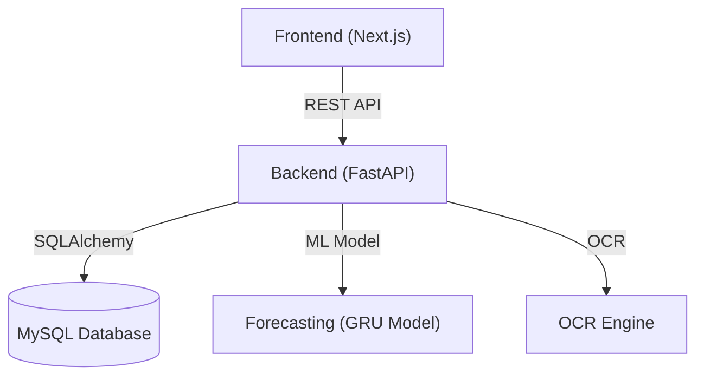

# AI-Driven Shelf System

## Overview

The **AI-Driven Shelf System** is an integrated platform designed to automate and optimize inventory management for retail environments using artificial intelligence. The system leverages machine learning for demand forecasting, OCR for expiry date extraction, and provides a modern web dashboard for real-time monitoring and manual adjustments. It aims to reduce waste, improve stock management, and streamline operations for businesses.

---

## Features

- **Product Management:** Add, update, and track products in inventory.
- **Stock & Sales Tracking:** Monitor stock levels and sales data.
- **Expiry Date Management:** Automatically extract expiry dates from product images using OCR, with manual override options.
- **Demand Forecasting:** Predict future product demand using advanced machine learning models.
- **Alerts & Notifications:** Receive alerts for low stock, upcoming expiries, and anomalies.
- **Modern Dashboard:** Intuitive web interface for real-time insights and manual operations.

---

## System Architecture



- **Frontend:** Built with Next.js (React), provides a responsive dashboard for users.
- **Backend:** FastAPI application handling business logic, ML inference, and database operations.
- **Database:** MySQL stores all product, stock, sales, and expiry data.
- **ML Model:** GRU-based model for demand forecasting.
- **OCR Engine:** Extracts expiry dates from product images.

---

## Technology Stack

- **Frontend:** Next.js, React, TypeScript, Tailwind CSS
- **Backend:** FastAPI, Python 3.12, SQLAlchemy
- **Database:** MySQL
- **Machine Learning:** TensorFlow/Keras (GRU), Scikit-learn
- **OCR:** Tesseract (via Python bindings)
- **Containerization:** Docker

---

## Folder Structure

```
AIDRIVE/
│
├── ai-driven-shelf-system-frontend/   # Next.js frontend
│   ├── src/
│   │   ├── app/                       # Pages and routes
│   │   ├── components/                # React components
│   │   ├── hooks/                     # Custom React hooks
│   │   ├── services/                  # API service functions
│   │   ├── types/                     # TypeScript types
│   │   └── utils/                     # Utility functions
│   └── public/                        # Static assets
│
├── backend/                           # FastAPI backend
│   ├── app/
│   │   ├── api/v1/endpoints/          # API route handlers
│   │   ├── core/                      # Config and logging
│   │   ├── db/                        # Database models and schemas
│   │   ├── services/                  # ML, OCR, business logic
│   │   └── utils/                     # Helper utilities
│   ├── images/                        # Sample images for OCR
│   ├── *.sql                          # Database setup scripts
│   ├── *.py                           # Setup and test scripts
│   └── requirements.txt               # Python dependencies
│
└── README.md                          # Project documentation
```

---

## Setup Instructions

### Prerequisites

- Node.js (v18+)
- Python 3.12
- MySQL Server
- Docker (optional, for containerized deployment)

---

### 1. Database Setup

1. **Create the Database:**
   - Run the SQL scripts in order:
     - `01_create_database.sql`
     - `02_create_products_table.sql`
     - `04_create_stock_table.sql`
     - `05_create_sales_table.sql`
     - `07_create_manual_expiry_table.sql`
     - `08_create_ocr_expiry_table.sql`
     - `06_create_views_and_procedures.sql`
   - Or run `00_run_all_scripts.sql` to execute all at once.

2. **Configure MySQL:**
   - Update `backend/app/core/config.py` and `.env` with your MySQL credentials.

3. **Populate Sample Data (Optional):**
   - Run `python backend/populate_sample_data.py` or `python backend/generate_comprehensive_data.py`.

---

### 2. Backend Setup

```bash
cd backend
python -m venv venv
venv\Scripts\activate  # On Windows
source venv/bin/activate  # On Unix
pip install -r requirements.txt
uvicorn app.main:app --reload
```

- The backend will be available at `http://localhost:8000`.

---

### 3. Frontend Setup

```bash
cd ai-driven-shelf-system-frontend
npm install
npm run dev
```

- The frontend will be available at `http://localhost:3000`.

---

## API Overview

- **Products:** `/api/v1/products/`
- **Stock:** `/api/v1/stock/`
- **Sales:** `/api/v1/sales/`
- **Expiry:** `/api/v1/expiry/`
- **Manual Expiry:** `/api/v1/manual_expiry/`
- **OCR Expiry:** `/api/v1/ocr_expiry/`
- **Forecast:** `/api/v1/forecast/`
- **Alerts:** `/api/v1/alerts/`

See `backend/ENDPOINTS_SUMMARY.md` for detailed API documentation.

---

## Contribution Guidelines

1. Fork the repository and create your branch.
2. Follow the existing code style and naming conventions.
3. Write clear commit messages.
4. Test your changes before submitting a pull request.
5. For major changes, open an issue first to discuss.

---

## License

This project is licensed under the MIT License. See the `LICENSE` file for details.

---


---

## Acknowledgements

- Open-source libraries and frameworks used in this project.
- Contributors and testers.
